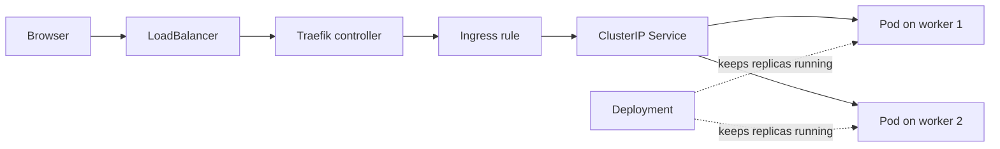

# HA Kubernetes

## 1. Setup

### Steps 1. Create the HA Configuration Filekind

Create a file named kind-ha.yaml and paste the following configuration:

```yaml
kind: Cluster
apiVersion: kind.x-k8s.io/v1alpha4
    nodes:
    # Control Plane Node 1
    - role: control-plane
    # Control Plane Node 2
    - role: control-plane
    # Control Plane Node 3
    - role: control-plane
    # Worker Node 1
    - role: worker
    # Worker Node 2
    - role: worker
```

### Steps 2. Launch the Cluster

Run the following command in your terminal to start the creation process:

```bash
kind create cluster --config cluster-kind-ha.yaml --name local-ha-cluster
```

What happens behind the scenes:

- kind will automatically download the necessary node images
- configure a secure HAProxy container load balancer in front of the control planes,
- spin up 3 control plane containers with stacked etcd, and
- attach 2 worker containers.3.

### Steps 3. Verify the HA Infrastructure

Once the command finishes, check your cluster topology by running:

```bash
kubectl get nodes -o wide
```

You will see an output listing 3 control plane nodes and 2 worker nodes all running locally.

## 2. Deployment

This section deploys the sample nginx app onto your HA kind cluster. The manifests in `deploy/` are tuned for high availability: **3 replicas** and **required pod anti-affinity** so Kubernetes spreads Pods across separate worker nodes.

| File | What it does |
|------|--------------|
| `deploy/deploy.yml` | Runs 3 app Pods with anti-affinity across nodes |
| `deploy/service.yml` | Stable internal ClusterIP for the Pods |
| `deploy/ingress.yml` | Routes outside traffic via Traefik |

Traffic flow:



### Prerequisites

Install these before continuing (same tools as the main project):

| Tool | Purpose |
|------|---------|
| [kind](https://kind.sigs.k8s.io/) | Runs the local multi-node HA cluster |
| `kubectl` | Talks to the cluster API |
| `helm` | Installs Traefik |
| [cloud-provider-kind](https://github.com/kubernetes-sigs/cloud-provider-kind) | Gives `LoadBalancer` Services an external IP on kind (like a cloud LB) |

```bash
brew install kind kubectl helm cloud-provider-kind
```

Section **1. Setup** must be finished and `kubectl get nodes` should show 3 control-plane and 2 worker nodes in `Ready` state.

---

### Connect to the HA cluster

kind writes a separate kubeconfig context for each cluster. Switch to the HA cluster:

```bash
kubectl config use-context kind-local-ha-cluster
kubectl get nodes -o wide
```

You should see 5 nodes. Control-plane nodes run the API server and etcd; worker nodes run your application Pods.

---

### Enable LoadBalancer support (production-like)

In production, the Ingress controller is exposed through a cloud **LoadBalancer**. kind has no built-in load balancer, so run [cloud-provider-kind](https://github.com/kubernetes-sigs/cloud-provider-kind) on your **host machine**. It watches the cluster and provisions load-balancer containers for `LoadBalancer` Services — the same Service type you use on AWS, GCP, or Azure.

Open a **separate terminal** and start the controller (leave it running):

```bash
cloud-provider-kind
```

On macOS/Linux you may need elevated privileges so it can bind ports:

```bash
sudo cloud-provider-kind
```

---

### Deploy Traefik (Ingress controller)

Install Traefik with Helm using `LoadBalancer` — same as the main project readme:

```bash
helm repo add traefik https://traefik.github.io/charts
helm repo update

helm install traefik traefik/traefik \
  --namespace traefik \
  --create-namespace \
  --set service.type=LoadBalancer
```

Verify Traefik is running:

```bash
kubectl get pods -n traefik
kubectl get svc -n traefik
```

The `traefik` Service should show an `EXTERNAL-IP` (on kind this is usually `127.0.0.1` or `localhost`).

---

### Deploy the sample app

From the `HA - architecture` directory, apply the manifests **in this order**:

```bash
kubectl apply -f deploy/deploy.yml
kubectl apply -f deploy/service.yml
kubectl apply -f deploy/ingress.yml
```

Check resources:

```bash
kubectl get deployments
kubectl get services
kubectl get ingress
kubectl get pods -l app=web-sample-app -o wide
```

Expected results:

- Deployment `web-sample-deployment`: at least `2/3` ready (see note below)
- Service `web-sample-service` on port 80
- Ingress host `localhost`, class `traefik`
- Pods spread across **different worker nodes** (`NODE` column in `-o wide` output)

#### Why you may see only 2 of 3 Pods running

`deploy/deploy.yml` sets `replicas: 3` and **required** pod anti-affinity: no two Pods with `app: web-sample-app` may land on the same node (`topologyKey: kubernetes.io/hostname`).

This cluster has **2 worker nodes**, so Kubernetes can schedule at most **2** Pods. The third stays `Pending` until you add another worker or relax the anti-affinity rule. That is intentional — it shows how strict HA scheduling interacts with cluster size.

To see why a Pod is stuck:

```bash
kubectl describe pod -l app=web-sample-app | grep -A5 Events
```

# Kubernetes Affinity vs Anti-Affinity

Kubernetes provides **Affinity** and **Anti-Affinity** rules to influence where Pods are scheduled.

These rules help improve application performance, availability, and fault tolerance.

---

# Pod Affinity

**Pod Affinity** tells Kubernetes:

> Schedule Pods close to other Pods.

This is useful when applications communicate frequently and benefit from being on the same node or in the same availability zone.

## Example

```yaml
affinity:
  podAffinity:
    requiredDuringSchedulingIgnoredDuringExecution:
    - labelSelector:
        matchLabels:
          app: backend
      topologyKey: kubernetes.io/hostname
```

### Meaning

Schedule this Pod on a node that already contains a Pod with:

```yaml
app: backend
```

### Result

```text
Node A
├── Backend Pod
└── Frontend Pod

Node B
└── Empty
```

### Common Use Cases

* Frontend and backend services with high communication traffic
* Cache servers and application servers
* Applications requiring low network latency

---

# Pod Anti-Affinity

**Pod Anti-Affinity** tells Kubernetes:

> Schedule Pods away from other Pods.

This is commonly used for high availability and fault tolerance.

## Example

```yaml
affinity:
  podAntiAffinity:
    requiredDuringSchedulingIgnoredDuringExecution:
    - labelSelector:
        matchLabels:
          app: web-app
      topologyKey: kubernetes.io/hostname
```

### Meaning

Do not schedule Pods with:

```yaml
app: web-app
```

on the same node.

### Result

```text
Node A
└── Web Pod 1

Node B
└── Web Pod 2

Node C
└── Web Pod 3
```

### Common Use Cases

* Web applications
* API services
* Stateful workloads
* Highly available systems

---

# Affinity vs Anti-Affinity

| Feature     | Affinity             | Anti-Affinity                         |
| ----------- | -------------------- | ------------------------------------- |
| Goal        | Keep Pods together   | Keep Pods apart                       |
| Purpose     | Reduce latency       | Increase availability                 |
| Scheduling  | Prefer same location | Prefer different locations            |
| Typical Use | Frontend ↔ Backend   | Multiple replicas of same application |

---

# topologyKey

The `topologyKey` determines what Kubernetes considers a "location".

## Node Level

```yaml
topologyKey: kubernetes.io/hostname
```

Pods are grouped by node.

Example:

```text
Node A
Node B
Node C
```

---

## Zone Level

```yaml
topologyKey: topology.kubernetes.io/zone
```

Pods are grouped by availability zone.

Example:

```text
Zone A
├── Node 1
├── Node 2

Zone B
├── Node 3
├── Node 4
```

This helps distribute workloads across zones.

---

# Required vs Preferred

Affinity rules support two scheduling modes.

## Required

```yaml
requiredDuringSchedulingIgnoredDuringExecution
```

Meaning:

> Kubernetes must satisfy this rule.

If no suitable node exists, the Pod remains in `Pending` state.

Example:

```text
3 replicas required
2 nodes available
Anti-affinity enabled

Result:
2 Pods Running
1 Pod Pending
```

---

## Preferred

```yaml
preferredDuringSchedulingIgnoredDuringExecution
```

Meaning:

> Kubernetes will try to satisfy the rule, but can ignore it if necessary.

Example:

```text
3 replicas
2 nodes

Result:
Node A -> Pod 1
Node B -> Pod 2
Node A -> Pod 3
```

The third Pod is scheduled anyway.

---

# Example: High Availability Web Application

Deployment:

```yaml
replicas: 3

affinity:
  podAntiAffinity:
    requiredDuringSchedulingIgnoredDuringExecution:
    - labelSelector:
        matchLabels:
          app: web-app
      topologyKey: kubernetes.io/hostname
```

Cluster:

```text
Node A
Node B
Node C
```

Scheduling Result:

```text
Node A -> Web Pod 1
Node B -> Web Pod 2
Node C -> Web Pod 3
```

Benefits:

* Survives single-node failure
* Better workload distribution
* Reduced risk of service outage

---

# When to Use Each

Use **Pod Affinity** when:

* Services communicate frequently
* Low latency is important
* You want workloads close together

Use **Pod Anti-Affinity** when:

* Running multiple replicas
* High availability is required
* You want protection from node failures

For most production web applications, **Pod Anti-Affinity** is recommended to ensure replicas are distributed across multiple nodes.

## Sample case : 
I only have 3 nodes in HA cluster then deploy using antiAffinity, do I need more than 3 nodes if I want 5 replica?

if you use requiredDuringSchedulingIgnoredDuringExecution with topologyKey: kubernetes.io/hostname, then Kubernetes can place at most one matching pod per node.

So if you have:
```
3 Nodes
Node A
Node B
Node C
```
and:
```
replicas: 5

podAntiAffinity:
  requiredDuringSchedulingIgnoredDuringExecution:
```
then scheduling looks like:
```
Node A -> Pod 1
Node B -> Pod 2
Node C -> Pod 3

Pod 4 -> Pending
Pod 5 -> Pending
```
because there are no additional nodes available.
Why? Your anti-affinity rule says:
```
Never place two pods with this label on the same hostname.
```
With:

```yaml
topologyKey: kubernetes.io/hostname
```
hostname = node.

Therefore:
```
1 matching pod
per node
```
Maximum replicas:

```
max replicas = number of schedulable nodes
What most production clusters do
```
Instead of:
```
requiredDuringSchedulingIgnoredDuringExecution
```
they often use:
```
preferredDuringSchedulingIgnoredDuringExecution
```
Example:
```yaml
affinity:
  podAntiAffinity:
    preferredDuringSchedulingIgnoredDuringExecution:
    - weight: 100
      podAffinityTerm:
        labelSelector:
          matchLabels:
            app: web-app
        topologyKey: kubernetes.io/hostname
```
Now Kubernetes tries to spread pods.

Result with 5 replicas and 3 nodes:
```
Node A -> Pod 1, Pod 4
Node B -> Pod 2, Pod 5
Node C -> Pod 3
```
Kubernetes prefers spreading but won't block scheduling.


## Better option: Topology Spread Constraints

Modern Kubernetes often uses:
`topologySpreadConstraints:` instead of `anti-affinity`.

Example:
```yaml
topologySpreadConstraints:
- maxSkew: 1
  topologyKey: kubernetes.io/hostname
  whenUnsatisfiable: ScheduleAnyway
  labelSelector:
    matchLabels:
      app: web-app
```

Result with 5 replicas:
```
Node A -> 2 Pods
Node B -> 2 Pods
Node C -> 1 Pod
```
Balanced distribution.

---

### Verify HA scheduling

Confirm Pods are on separate workers:

```bash
kubectl get pods -l app=web-sample-app -o custom-columns=NAME:.metadata.name,NODE:.spec.nodeName,STATUS:.status.phase
```

You should see each running Pod on a different `NODE` name (for example `local-ha-cluster-worker` and `local-ha-cluster-worker2`).

#### Simulate a worker failure

Find a worker container name:

```bash
docker ps --filter "name=local-ha-cluster-worker" --format "{{.Names}}"
```

Stop one worker (replace with the name from above):

```bash
docker stop local-ha-cluster-worker
```

Watch Kubernetes reschedule Pods onto the remaining worker:

```bash
kubectl get pods -l app=web-sample-app -w
```

Restart the worker when you are done testing:

```bash
docker start local-ha-cluster-worker
```

---

### Open the app

The Ingress uses `host: localhost`. Open in your browser:

```text
http://localhost
```

You should see the default nginx welcome page.

Verify with curl:

```bash
curl http://localhost
```

---

### Update after editing a manifest

Re-run `kubectl apply` on the file you changed:

```bash
kubectl apply -f deploy/deploy.yml   # example: after changing replicas or affinity
```

---

### Useful commands

```bash
# Cluster topology
kubectl get nodes -o wide

# Pod placement and restarts
kubectl get pods -l app=web-sample-app -o wide
kubectl describe deployment web-sample-deployment

# Logs from a Pod (replace POD_NAME)
kubectl logs POD_NAME

# Delete everything from this project
kubectl delete -f deploy/ingress.yml
kubectl delete -f deploy/service.yml
kubectl delete -f deploy/deploy.yml
```

---

### Delete the HA cluster

When you are finished:

```bash
kind delete cluster --name local-ha-cluster
kubectl config use-context docker-desktop   # or your previous context
```

---

## Troubleshooting

| Problem | What to check |
|---------|---------------|
| `kubectl get nodes` fails | Did you run `kubectl config use-context kind-local-ha-cluster`? Is the cluster still up (`docker ps \| grep local-ha-cluster`)? |
| Third Pod stuck `Pending` | Expected with 2 workers + required anti-affinity. Add a worker node or lower `replicas` to `2`. |
| `helm install` fails | Is Traefik already installed? `helm list -n traefik`. Uninstall with `helm uninstall traefik -n traefik` and retry. |
| Traefik `EXTERNAL-IP` stays `<pending>` | Is `cloud-provider-kind` running in a separate terminal? Restart it after creating the cluster. |
| Browser shows nothing | Is Traefik running? `kubectl get svc -n traefik`. Try `curl http://localhost` |
| Wrong Ingress controller | Ingress must set `spec.ingressClassName: traefik` |
| Pods all on one node | Check anti-affinity in `deploy/deploy.yml` and that you have multiple workers in `Ready` state |