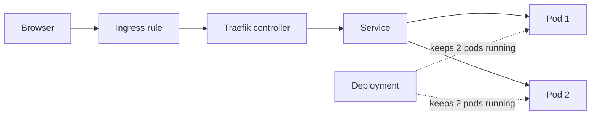
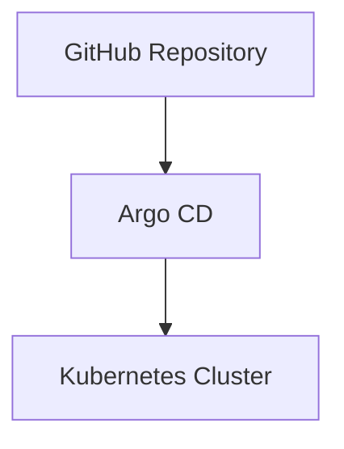
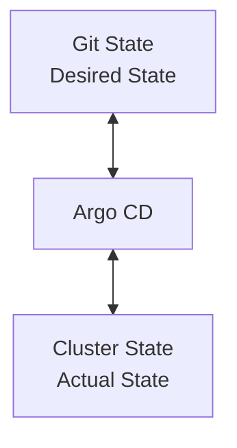

# Learn Kubernetes

A hands-on guide to running a simple web app on a local Kubernetes cluster using Docker Desktop, Traefik, and the manifests in `deploy/`.

## What you'll build

You will deploy **nginx** (standing in for your real app) with:

| File | What it does |
|------|--------------|
| `deploy/deploy.yml` | Runs 2 copies of the app (Pods) |
| `deploy/service.yml` | Gives the Pods a stable internal address |
| `deploy/ingress.yml` | Routes outside traffic to the Service via Traefik |

Traffic flow:



---

## 1. Prerequisites

Install these on your Mac before you start:

| Tool | Purpose |
|------|---------|
| [Docker Desktop](https://www.docker.com/products/docker-desktop/) | Runs containers and a local Kubernetes cluster |
| `kubectl` | Command-line tool to talk to Kubernetes |
| `helm` | Installs Traefik (the Ingress controller) |

**Enable Kubernetes in Docker Desktop:** Settings → Kubernetes → Enable Kubernetes → Apply & Restart.

### Install kubectl

```bash
brew install kubectl
kubectl version --client
```

### Install Helm

```bash
brew install helm
helm version
```

<details>
<summary>Install Helm on other platforms</summary>

```bash
# Windows (Chocolatey)
choco install kubernetes-helm

# Windows (Winget)
winget install Helm.Helm

# Linux (Snap)
sudo snap install --classic helm
```

</details>

---

## 2. Connect to your cluster

Docker Desktop writes cluster settings to `~/.kube/config` automatically. Point `kubectl` at it:

```bash
kubectl config use-context docker-desktop
kubectl get nodes
```

You should see one node in `Ready` state.

### Switching contexts

A **context** is a saved connection (cluster + user + default namespace). Useful when you have more than one cluster.

```bash
# List contexts — the one with * is active
kubectl config get-contexts

# Switch to another cluster
kubectl config use-context <CONTEXT_NAME>
```

---

## 3. Key concepts (quick read)

### Pods and Deployments

- A **Pod** is one running instance of your app.
- A **Deployment** keeps a fixed number of Pods running. If one crashes, Kubernetes starts a replacement.

### Service — stable address inside the cluster

Pods get new IP addresses whenever they restart. A **Service** gives you one name and IP that always routes to the right Pods.

Common Service types:

| Type | Use case |
|------|----------|
| **ClusterIP** (default) | Internal traffic only — used with Ingress |
| **NodePort** | Opens a port on every node |
| **LoadBalancer** | Gets a public IP from a cloud provider |

This project uses **ClusterIP** because Traefik handles outside traffic.

### Ingress — route HTTP requests to your app

An **Ingress** rule says: "when someone visits `localhost`, send traffic to `web-sample-service`."

An **Ingress controller** (Traefik) reads those rules and actually forwards the traffic. You install Traefik once; then you apply Ingress rules per app.

---

## 4. Deploy Traefik (Ingress controller)

Install Traefik with Helm into its own namespace:

```bash
helm repo add traefik https://traefik.github.io/charts
helm repo update

helm install traefik traefik/traefik \
  --namespace traefik \
  --create-namespace \
  --set service.type=LoadBalancer
```

Verify it is running:

```bash
kubectl get pods -n traefik
kubectl get svc -n traefik
```

The Traefik Service should show an external IP (on Docker Desktop this is often a local address like `localhost` or `127.0.0.1`).

---

## 5. Deploy the sample app

Apply the manifests **in this order**:

```bash
kubectl apply -f deploy/deploy.yml    # 1. Start the app Pods
kubectl apply -f deploy/service.yml   # 2. Expose Pods internally
kubectl apply -f deploy/ingress.yml   # 3. Route traffic from outside
```

Check everything is healthy:

```bash
kubectl get deployments
kubectl get services
kubectl get ingress
kubectl get pods -l app=web-sample-app
```

Expected results:

- Deployment: `2/2` ready
- Service: `web-sample-service` on port 80
- Ingress: host `localhost`, class `traefik`
- Pods: 2 running

### Open the app

The Ingress uses `host: localhost`. Open in your browser:

```
http://localhost
```

You should see the default nginx welcome page.

### Update after editing a manifest

Re-run `kubectl apply` on the file you changed. Kubernetes updates the existing resource — no need to delete first.

```bash
kubectl apply -f deploy/deploy.yml   # example: after changing replicas or image
```

---

## 6. Useful commands

```bash
# Namespaces
kubectl get ns

# All pods or services across every namespace
kubectl get pods -A
kubectl get svc -A

# Logs from a Pod (replace POD_NAME)
kubectl logs POD_NAME

# Delete everything from this project
kubectl delete -f deploy/ingress.yml
kubectl delete -f deploy/service.yml
kubectl delete -f deploy/deploy.yml
```

---

## Troubleshooting

| Problem | What to check |
|---------|---------------|
| `kubectl get nodes` fails | Kubernetes enabled in Docker Desktop? Context set to `docker-desktop`? |
| Pods not ready | `kubectl describe pod <name>` and `kubectl logs <name>` |
| Browser shows nothing | `kubectl get ingress` — is Traefik running? Try `curl -H "Host: localhost" http://localhost` |
| Wrong Ingress controller | Ingress must set `spec.ingressClassName: traefik` |

---

# Argo CD Learn

## Install Argo CD

Create an isolated namespace and install Argo CD using the stable manifests.

### Create Namespace

```bash
kubectl create namespace argocd
```

### Apply Installation Manifest

Normally:

```bash
kubectl apply -n argocd -f argocd.yml
```

if you got this error

```
The CustomResourceDefinition "applicationsets.argoproj.io" is invalid: metadata.annotations: Too long: may not be more than 262144 bytes
```

This error caused by newer versions of the Argo CD ApplicationSet CustomResourceDefinition (CRD) are too large for standard client-side deployments. By default, kubectl apply tries to inject the entire manifest payload into a hidden metadata annotation (kubectl.kubernetes.io/last-applied-configuration). This instantly breaks past the hard 256 KiB (262,144 bytes) limit enforced by the Kubernetes API server.Run the installation command again using the --server-side flag to bypass the client-side annotation requirement entirely.

For this project, use **server-side apply**:

```bash
kubectl apply --server-side -n argocd -f argocd.yml
```

---

## Get Default Admin Password

Retrieve the initial admin password:

```bash
kubectl -n argocd get secret argocd-initial-admin-secret \
-o jsonpath="{.data.password}" | base64 -d && echo
```

Default username:

```text
admin
```

---

## Access Argo CD UI

By default, the Argo CD server is not exposed externally.

Create a port-forward:

```bash
kubectl port-forward svc/argocd-server -n argocd 8080:443
```

Open the following URL:

```text
https://localhost:8080
```

Login using:

- Username: `admin`
- Password: Retrieved from the previous step

---

# Connect Git Repository

1. Open **Settings**
2. Select **Repositories**
3. Click **+ Connect Repo**

For this project, use a GitHub Personal Access Token (PAT).

### Repository Configuration

Connection Method:

```text
HTTPS
```

Repository URL:

```text
https://github.com/zcky1990/learn-kubernetes
```

Fill the following information:

| Field          | Value                        |
| -------------- | ---------------------------- |
| Name           | Your repository name         |
| Project        | Default or your project      |
| Repository URL | GitHub repository URL        |
| Username       | Your GitHub username         |
| Password       | GitHub Personal Access Token |

> The Personal Access Token should start with `ghp_`.

Click **Connect**.

If the repository is connected successfully, continue to the next step.

---

# Create Application

For learning purposes, create the application manually through the Argo CD UI.

1. Click **New App**
2. Fill in the application details
3. Select the connected repository
4. Choose the target branch or tag
5. Set the path containing the Kubernetes manifests. For this project we are targeting `deploy` folder
6. Click **Create**

---

# Understanding the GitOps Flow



Argo CD continuously compares:



When changes are detected, Argo CD synchronizes the cluster to match Git.

---

# Test Argo CD Synchronization

Modify the deployment manifest.

Example:

Before:

```yaml
replicas: 2
```

After:

```yaml
replicas: 3
```

Commit and push the changes:

```bash
git add .
git commit -m "increase replicas"
git push
```

---

## Verify Synchronization

Check the application status in Argo CD.

Expected status:

```text
Healthy
Synced
```

Verify the deployment:

```bash
kubectl get deployment
```

Verify the pods:

```bash
kubectl get pods
```

---

# Enable Auto Sync (Recommended)

When creating the application, enable:

```text
Auto Sync
Prune
Self Heal
```

## Self Heal

If someone modifies the cluster manually:

```bash
kubectl edit deployment nginx
```

Argo CD automatically restores the configuration from Git.

## Prune

If a resource is removed from Git:

```text
deployment.yaml deleted
```

Argo CD will remove the resource from the cluster.

---

# Why Use Server-Side Apply?

This project uses:

```bash
kubectl apply --server-side -n argocd -f argocd/argocd.yml
```

Benefits:

- Better field ownership management
- Reduced merge conflicts
- Better compatibility with GitOps workflows
- Recommended for large manifests
- Kubernetes API Server performs the merge operation

---
