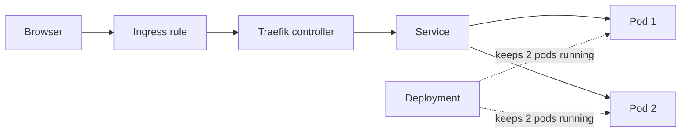

# Learn Kubernetes

A hands-on guide to running a simple web app on a local Kubernetes cluster using Docker Desktop, Traefik, and the manifests in `deploy/`.

## What you'll build

You will deploy **nginx** (standing in for your real app) with:

| File | What it does |
|------|--------------|
| `deploy/deploy.yml` | Runs 2 copies of the app (Pods) |
| `deploy/service.yml` | Gives the Pods a stable internal address |
| `deploy/ingress.yml` | Routes outside traffic to the Service via Traefik |

Traffic flow:



---

## 1. Prerequisites

Install these on your Mac before you start:

| Tool | Purpose |
|------|---------|
| [Docker Desktop](https://www.docker.com/products/docker-desktop/) | Runs containers and a local Kubernetes cluster |
| `kubectl` | Command-line tool to talk to Kubernetes |
| `helm` | Installs Traefik (the Ingress controller) |

**Enable Kubernetes in Docker Desktop:** Settings → Kubernetes → Enable Kubernetes → Apply & Restart.

### Install kubectl

```bash
brew install kubectl
kubectl version --client
```

### Install Helm

```bash
brew install helm
helm version
```

<details>
<summary>Install Helm on other platforms</summary>

```bash
# Windows (Chocolatey)
choco install kubernetes-helm

# Windows (Winget)
winget install Helm.Helm

# Linux (Snap)
sudo snap install --classic helm
```

</details>

---

## 2. Connect to your cluster

Docker Desktop writes cluster settings to `~/.kube/config` automatically. Point `kubectl` at it:

```bash
kubectl config use-context docker-desktop
kubectl get nodes
```

You should see one node in `Ready` state.

### Switching contexts

A **context** is a saved connection (cluster + user + default namespace). Useful when you have more than one cluster.

```bash
# List contexts — the one with * is active
kubectl config get-contexts

# Switch to another cluster
kubectl config use-context <CONTEXT_NAME>
```

---

## 3. Key concepts (quick read)

### Pods and Deployments

- A **Pod** is one running instance of your app.
- A **Deployment** keeps a fixed number of Pods running. If one crashes, Kubernetes starts a replacement.

### Service — stable address inside the cluster

Pods get new IP addresses whenever they restart. A **Service** gives you one name and IP that always routes to the right Pods.

Common Service types:

| Type | Use case |
|------|----------|
| **ClusterIP** (default) | Internal traffic only — used with Ingress |
| **NodePort** | Opens a port on every node |
| **LoadBalancer** | Gets a public IP from a cloud provider |

This project uses **ClusterIP** because Traefik handles outside traffic.

### Ingress — route HTTP requests to your app

An **Ingress** rule says: "when someone visits `localhost`, send traffic to `web-sample-service`."

An **Ingress controller** (Traefik) reads those rules and actually forwards the traffic. You install Traefik once; then you apply Ingress rules per app.

---

## 4. Deploy Traefik (Ingress controller)

Install Traefik with Helm into its own namespace:

```bash
helm repo add traefik https://traefik.github.io/charts
helm repo update

helm install traefik traefik/traefik \
  --namespace traefik \
  --create-namespace \
  --set service.type=LoadBalancer
```

Verify it is running:

```bash
kubectl get pods -n traefik
kubectl get svc -n traefik
```

The Traefik Service should show an external IP (on Docker Desktop this is often a local address like `localhost` or `127.0.0.1`).

---

## 5. Deploy the sample app

Apply the manifests **in this order**:

```bash
kubectl apply -f deploy/deploy.yml    # 1. Start the app Pods
kubectl apply -f deploy/service.yml   # 2. Expose Pods internally
kubectl apply -f deploy/ingress.yml   # 3. Route traffic from outside
```

Check everything is healthy:

```bash
kubectl get deployments
kubectl get services
kubectl get ingress
kubectl get pods -l app=web-sample-app
```

Expected results:

- Deployment: `2/2` ready
- Service: `web-sample-service` on port 80
- Ingress: host `localhost`, class `traefik`
- Pods: 2 running

### Open the app

The Ingress uses `host: localhost`. Open in your browser:

```
http://localhost
```

You should see the default nginx welcome page.

### Update after editing a manifest

Re-run `kubectl apply` on the file you changed. Kubernetes updates the existing resource — no need to delete first.

```bash
kubectl apply -f deploy/deploy.yml   # example: after changing replicas or image
```

---

## 6. Useful commands

```bash
# Namespaces
kubectl get ns

# All pods or services across every namespace
kubectl get pods -A
kubectl get svc -A

# Logs from a Pod (replace POD_NAME)
kubectl logs POD_NAME

# Delete everything from this project
kubectl delete -f deploy/ingress.yml
kubectl delete -f deploy/service.yml
kubectl delete -f deploy/deploy.yml
```

---

## Troubleshooting

| Problem | What to check |
|---------|---------------|
| `kubectl get nodes` fails | Kubernetes enabled in Docker Desktop? Context set to `docker-desktop`? |
| Pods not ready | `kubectl describe pod <name>` and `kubectl logs <name>` |
| Browser shows nothing | `kubectl get ingress` — is Traefik running? Try `curl -H "Host: localhost" http://localhost` |
| Wrong Ingress controller | Ingress must set `spec.ingressClassName: traefik` |
